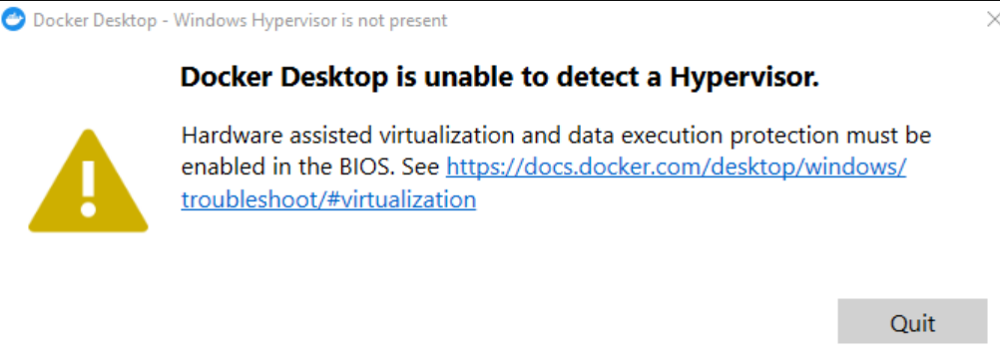

# ***Docker***

## **Installation**
1. Download `docker desktop`

## **Notes**
- **containers**: completed isolated environments
  - own processes and services
  - own OS
- uses LXC containers
- all OS consists of OS kernel and set of software
  - OS kernel => interacts with hardware
  - software => differentiates with various types of OS
- Sharing the kernel
  - docker can run any flavor of OS as long as kernel is the same
  - e.g docker on OS-Ubuntu can run any linux distribution because linux kernel is the same
- lightweight version of virtual machine because does need underlying OS in each container
- to run instance of software

```bash
docker run ansible
```

- **images**: package or template to create one or more containers
  - containers are running instances of images that are self-contained and have own processes and operations

## **Commands**

`docker build <directory with source files>`: builds docker image using source files

`docker build -t <name of app> <directory>`: builds the image with a tag

`docker build -t <app name>: <tag name> <directory>`: builds the image with a specified tag

`docker images`: display the list of images

`docker kill <container id>`: kills a container process (will need to use `docker ps` beforehand)

`docker ps`: lists all processing

`docker run -it <your-image-id>`: run a containwer with a given image id

`docker run -it -p <host port>:<container port> <image-id>`: run container via a specified host and container ports


### **Dockerfile Instructions**

`CMD <command>`: command to run when container starts
- *shellform*: command as one string
  - e.x `CMD go run hello-world.go`
- *execform*: command in form of an array
  - e.x `CMD ["go", "run" "hello-world.go"]`
- CAN have parameters overriden

`COPY <origin> <destination>`: copies data from the origin to the destination

`ENTRYPOINT <command>`: command that always runs when a container starts
- *shellform*: command as one string
  - e.x `ENTRYPOINT go run hello-world.go`
- *execform*: command in form of an array
  - e.x `ENTRYPOINT ["go", "run" "hello-world.go"]`
- CANNOT have parameters overriden

`ENV <environment variable> <value to assign>`: changes the environment variable

`EXPOSE <port number>`: updates metadata; tells Docker the port that the container will listen on

`FROM <path of image file>`: grabs the base image from the provided path

`RUN <command>`: run command in the latest layer and save results into the next layer


## **Issues**

### **Windows**

1. Running `Docker Desktop` runs into "Hypervisor not found issue" on Windows
   
   **Solution**:
   
   1. Open windows powershell as administrator
   2. run `bcdedit /set hypervisorlaunchtype auto` in order to set the *hypervisorlaunchtype* to `auto`
   3. reboot the machine
   4. verify that *hypervisorlaunchtype* is set to `auto` by running the command `bcdedit`